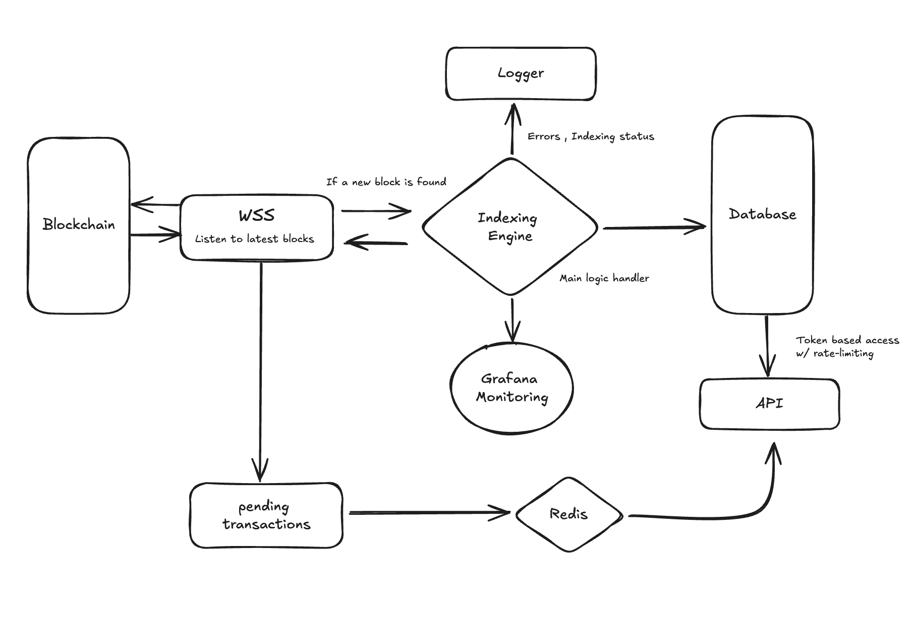

# Chitra

A basic EVM blockchain indexer implementation.

## Features:
- Indexes and stores all block data from Block x to Block y
- Indexes and stores all transactions data of the indexed blocks in a separate dB

## Setup
- Clone this repository
- Add the relevant details in the .env file
- Create two databases according to the fields provided in  **db.rs** file
- ``cargo run``

## TO DO
- Option to choose start and end block of indexing
- Transactions indexing
- Logic to handle pending transactions
- Proper error handling and logging
- Smart contract events indexing
- Cli tool to set all env variables

